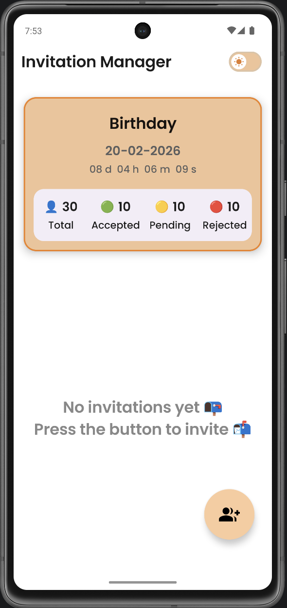
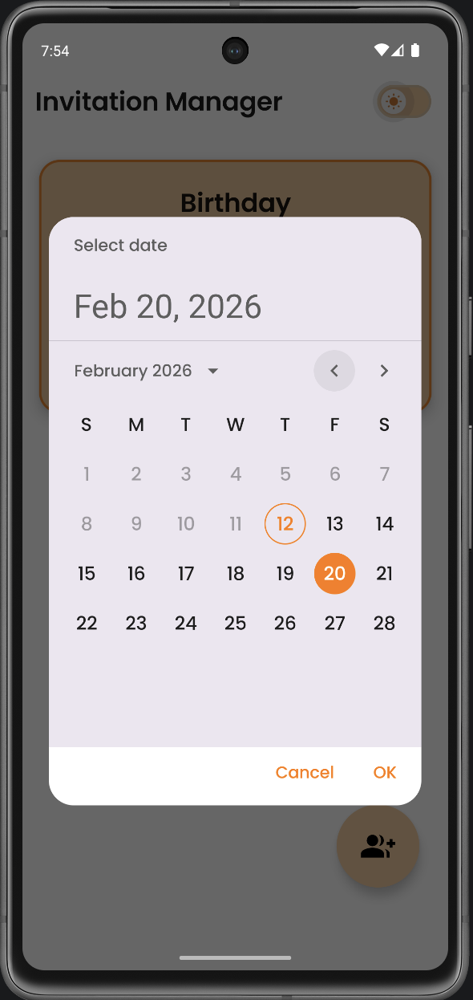
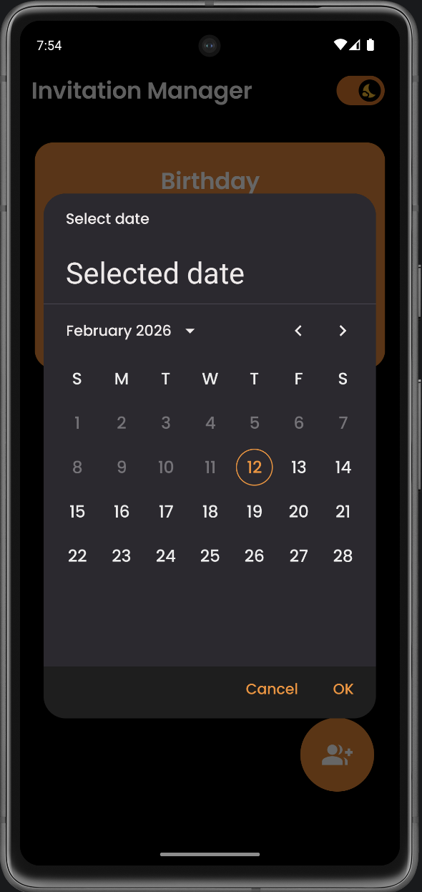
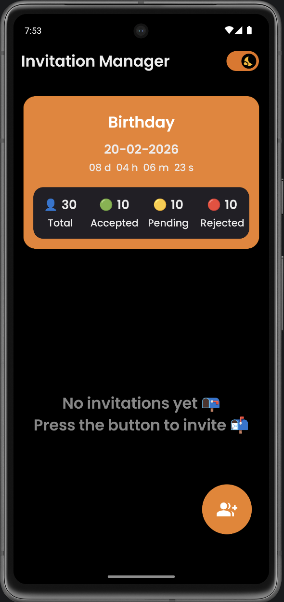

# ⏳ Event Countdown Component – Jetpack Compose

A Jetpack Compose component that allows users to select a future date using a Material 3 calendar picker and displays a live countdown until the selected event. This component has been used in my project <b>InviteBuddy</b> , an Invitation Manager Application.

This component is designed to be modular and reusable across any type of application:
- Event tracking
- Task deadlines
- Product launches
- Announcements
- Reminders
- Campaign timers
- Personal milestones

---

## ✨ Features

### 🗓 Calendar-Based Date Selection
- Built using Material 3 `DatePickerDialog`
- Clean calendar UI
- Date format: `dd-MM-yyyy`
- Strict date parsing (non-lenient)
- Locale-aware formatting

### 🚫 Date Restrictions
- Past dates cannot be selected
- Today's date is restricted
- Optional warning message (Toast/Snackbar)
- Ensures only future events are scheduled

### ⏳ Live Countdown Timer
Displays:
- Days
- Hours
- Minutes
- Seconds

Automatically updates every second.

### 🎨 Dynamic Countdown States

| Time Remaining | Visual State |
|---------------|-------------|
| > 1 Day       | Default state |
| ≤ 1 Day       | Warning color |
| ≤ 1 Hour      | Critical color |
| Event Live    | Celebration mode |

### 🎉 Celebration Mode
- Pulsating animation
- Confetti animation using Canvas
- Enhanced contrast in dark mode

### 🌙 Dark & Light Mode Support
- Fully adaptive to Material 3 color scheme
- Improved text visibility in dark theme
- Accessible color contrast handling

---

## 📸 Glimpses

  
  
  
  

---

## ⚙️ Behavior

- Countdown runs until 23:59:59 of the selected date.
- Automatically transitions to "Event is happening!" when time reaches zero.
- UI updates dynamically based on remaining time.
- Designed as a reusable composable component.

---

## 🧠 Tech Stack

- Kotlin
- Jetpack Compose
- Material 3
- Compose Animation APIs
- Canvas-based particle animation

---

## 🔧 Customization Options

You can easily customize:
- Celebration text
- Countdown format
- Color thresholds
- Animation speed
- Confetti particle count
- Date format
- Warning behavior

---

## 🚀 Example Use Cases

- Deadline tracker
- Product launch countdown
- Marketing campaign timer
- Study/exam countdown
- Fitness challenge timer
- Personal milestone tracker

---

## 📌 Design Goals

- Fully reusable
- Stateless-friendly
- Theme-aware
- Clean Material 3 implementation
- Production-ready animation handling

---

Built using modern Jetpack Compose architecture.
